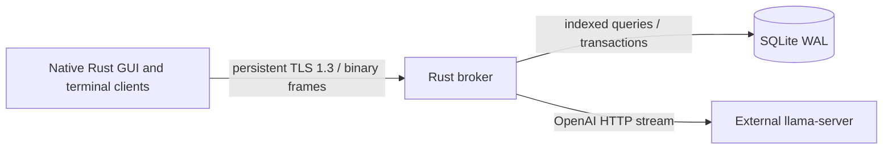

# Architecture

## Context and boundaries

The native client owns presentation and a revision cursor. The broker is authoritative for identity, authorization, RP data, prompt compilation, orchestration, and stream optimization. llama.cpp owns model inference and is reached only by the broker over its OpenAI-compatible HTTP interface.

## Interfaces

Every client frame has `[payload_len:u32 BE][flags:u8][message_type:u8][request_id:u64 BE][payload]`. Payloads use bincode 2. Flag bit zero means zstd. Unknown flags/types and payloads over 8 MiB are rejected before allocation. Runtime traffic never uses JSON. The bounded 32-frame writer queue propagates slow-client backpressure to generation. Chunks flush at 32 whitespace-separated units or 60 ms, so llama token events never become client packets.

TLS permits only TLS 1.3. A deployment CA is the client's explicit pinned trust anchor without an insecure verifier. Protocol version 7 uses a one-time typed `Snapshot` after authentication; connections then persist until shutdown or network failure, and `Resume`/`Sync` replay only ordered deltas after reconnection. Committed mutations are also pushed to other live connections authenticated as the same owner. A lagging subscriber is disconnected instead of silently skipping revisions, causing normal reconnect/resume recovery from the durable delta log. Before authentication, the only exposed policy capability is whether public self-registration is enabled.

The backend adapter probes `/models` at startup and before generation and validates the configured model ID. Generic providers stream OpenAI-compatible `/chat/completions`; Ollama mode streams native `/api/chat` so runtime options are honored. Admin-only native API calls manage model inventory and allocation without exposing Ollama to clients. Enabled state, URL, provider mode, model selection, and generation defaults are persisted in the singleton broker settings row. Context consists of character rules, group names, triggered priority lore, scoped memory, and at most 80 recent messages. Automatic speaker selection uses a bounded non-streaming model call, validates against participants, and deterministically falls back to round-robin.

## Data ownership

Five SQLite migrations define users, expiring sessions, characters, conversations, ordered participants, messages, variants, lore, memories, an indexed delta log, public-character state and broker settings. Owner predicates enforce tenant boundaries. Message/context and delta-sync indexes avoid full table reads. The first account receives admin role; authorization remains broker-side. Admin account deletion is an ordered transaction that clears dependent sessions and RP records before the user row. Admin database inspection is an allowlisted projection and never returns credential/session/chat content.

The GUI persists only the session token and role in a mode-`0600` file; it never stores credentials. The broker persists Argon2 password hashes and expiring opaque tokens. Public registration, admin-created accounts, role changes, public-character policy and user deletion are separate server-authorized operations.

## Failure behavior

TLS and corrupt frames close only the affected connection. Backend probe, HTTP, missing-model, and stream failures return request errors without taking down the listener. Generation cancellation is keyed by request ID and interrupts the upstream body stream. Bounded queues cap client memory. SQLite WAL and transactions protect multi-row conversation creation.

## Constraints and risks

- The GUI's protected session file is not an OS credential store/keyring.
- The delta log needs an operator-configured retention policy once clients track durable cursors.
- ARM64 is built natively on an `aarch64-unknown-linux-gnu` host; deploy the same `packaging/chatty-broker.service` and `packaging/chatty.desktop` as on x86-64. The broker has no GUI dependencies.
- llama-server transport is assumed to be on a trusted LAN. Put it behind TLS or a private interface when it crosses a trust boundary.
- Protocol enums use bincode and are ordering-sensitive; rebuild broker and every client together after contract changes and bump the JSON handshake version.
